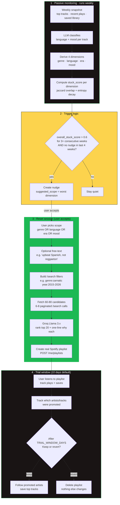
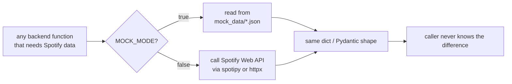
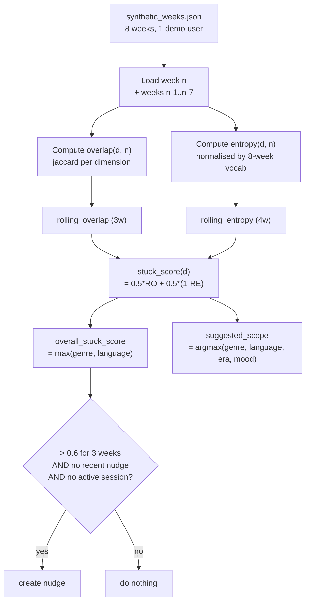
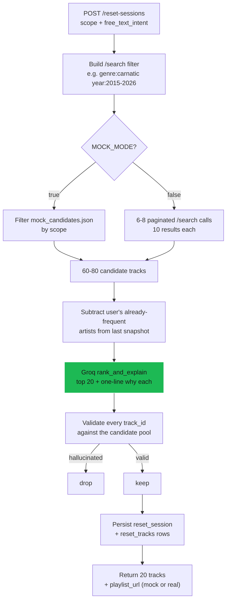
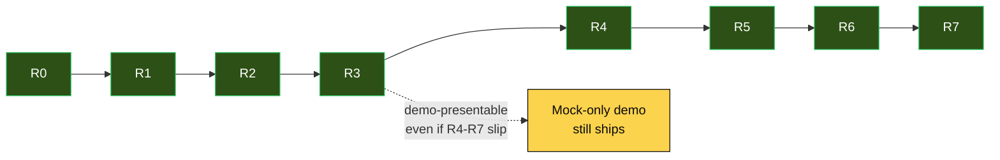
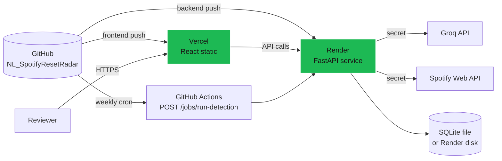

# Architecture - AI-Native MVP: Reset Radar (Part 4-5)

> **PIVOT NOTE (2026-06-26):** This folder's MVP was pivoted from "Sonar"
> (a user-initiated, intent-driven discovery agent) to **Reset Radar**
> (a system-initiated, passive stuck-detection + scoped-reset companion).
> The pivot was made because:
>
> 1. The root-cause analysis in `03-research-and-deck/problem-definition/one-pager.md`
>    identifies "no fast correction mechanism" as one of three structural
>    causes. A *user-initiated* tool (Sonar) only helps users who already
>    know they need a tool. A *system-initiated* tool (Reset Radar)
>    addresses the stuck user *whether or not they think to act*.
> 2. The closest existing Spotify feature - AI Playlist - already covers
>    the user-initiated case. Reset Radar's system-initiated framing is
>    architecturally distinct from anything Spotify ships today.
> 3. Spotify's public Web API was restricted in Nov 2024 and Feb 2026 -
>    `/recommendations` and `/audio-features` are gone for new apps.
>    Reset Radar's architecture (statistical detection + scoped reset via
>    `/search` + LLM ranking) survives those restrictions cleanly; Sonar's
>    design depended on the removed endpoints.
>
> The previous "Sonar" architecture lives in `legacy-sonar/` (not active).
> Companion: [`problemStatement.md`](./problemStatement.md).

---

## 1. The MVP at a glance

**Reset Radar** is a Spotify companion app that solves the "comfort loop"
problem: long-time Premium users get trapped in narrowing recommendations
because Spotify's system only reacts to manual input (skip, snooze, edit
taste profile) and never initiates anything itself.

Reset Radar is **system-initiated**. It quietly watches a user's listening
diversity over time, and only when it detects genuine stagnation does it
proactively offer a fix - a **scoped** reset (just genre, or just language,
or just era - not everything) that runs as a **sandboxed, time-boxed
trial** before anything is permanently kept.

> **Working name:** "Reset Radar" - the listener-side companion that knows
> when you're stuck before you do, and offers a way out that doesn't
> rewrite your whole profile.



**This MVP is for a product-management demo, not a production app.**
The priority is a working, clickable, narratively coherent demo over
completeness. Mock mode (Section 8) is the most important component for
the deadline; it lets the entire flow run end-to-end with zero live
Spotify calls.

---

## 2. Core mechanism (must be implemented exactly as specified)

For each user, maintain a **weekly snapshot** of their listening activity,
broken into four independent dimensions:

| Dimension | Source | How it's derived |
|---|---|---|
| **`genre`** | Spotify artist `genres` field | Direct read via `GET /artists/{id}` (one call per unique artist in the snapshot) |
| **`language`** | LLM classification | Spotify has no language field. Groq classifies based on artist name + track titles + genre tags |
| **`era`** | Decade bucket | Derived from track or album release year. Buckets: `1960s`, `1970s`, `1980s`, ..., `2020s` |
| **`mood`** | LLM classification | Spotify's `/audio-features` endpoint was removed for new apps in Nov 2024. Groq classifies from genre + track/album/artist text. Treat as an approximation. |

### The math (the trigger formulas)

For each dimension `d`, each week `n`:

```
overlap(d, n)         = jaccard(values(d, n), values(d, n-1))
                        // jaccard(A, B) = |A ∩ B| / |A ∪ B|
                        // higher = more repetition vs last week

rolling_overlap(d)    = mean(overlap(d, n), overlap(d, n-1), overlap(d, n-2))
                        // trailing 3 weeks; smooths out one-off variance

entropy(d, n)         = shannon_entropy(distribution(d, n))
                        / log2(unique_values_seen(d, trailing_8_weeks))
                        // normalised 0-1; lower = less diverse

rolling_entropy(d)    = mean(entropy(d, n), ..., entropy(d, n-3))
                        // trailing 4 weeks

stuck_score(d)        = 0.5 * rolling_overlap(d)
                        + 0.5 * (1 - rolling_entropy(d))
                        // range 0-1; higher = more stuck on dimension d
```

Overall:

```
overall_stuck_score   = max(stuck_score(genre), stuck_score(language))
suggested_scope       = argmax over {genre, language, era, mood}
                        of stuck_score(d)
```

> **Why max-of-two for the overall, but argmax-of-four for the scope:**
> the overall trigger fires on the two dimensions most likely to be
> genuinely "stuck" (genre + language), but the suggested *fix* can use
> any of the four. This stops era/mood noise from triggering false
> positives while still letting the reset be subtle when era/mood is the
> right knob.

### Trigger rule

Fire a nudge **when all of:**

```
overall_stuck_score(week)   > STUCK_THRESHOLD            (default 0.6)
                  AND for STUCK_STREAK_WEEKS              (default 3)
                  consecutive weekly evaluations
AND no nudge shown or accepted in the last COOLDOWN_WEEKS (default 4)
AND no reset session currently active for that user
```

The trigger function MUST be:

- **Pure** - identical inputs → identical outputs, no global state, no I/O
- **Unit-testable** against the `mock_data/synthetic_weeks.json` fixture
- **Source of truth** - both real Spotify data and mock data flow through
  the same function

> **Files:** `backend/app/detection.py` (Python) - the only place the
> formulas live. Frontend never re-implements them.

---

## 3. Tech stack

| Layer | Choice | Why |
|---|---|---|
| **Backend** | **Python 3.11+ · FastAPI** | Async I/O for parallel Spotify calls; pluggable into the existing Groq client; clean OpenAPI docs auto-generated |
| **Frontend** | **React + Vite · JavaScript** (no TS, for speed) | Charts (stuck-score over time) are easier in React than Streamlit; demo polish matters here |
| **Database** | **SQLite** (file-based) | Zero setup; schema designed to be portable to Postgres later if needed |
| **LLM** | **Groq API** (Llama 3.x) | Same provider as the Review Engine; one secret, one SDK |
| **Scheduler** | **GitHub Actions weekly cron** | Free; visible artefact ("system is proactive") · plus a manual "run detection now" endpoint so the demo doesn't depend on real time passing |
| **Spotify auth** | **OAuth Authorization Code Flow with PKCE** | Required by Spotify for any read access to a user's listening data |
| **Deployment** | **Render / Railway / Fly** for backend, **Vercel / Netlify** for frontend | Streamlit Cloud no longer fits because we have a FastAPI backend + React frontend, not a single Streamlit app |

**Why NOT Streamlit anymore:** Sonar (the old MVP) was a one-shot
intent-box; Streamlit was perfect for that. Reset Radar has stateful
weekly snapshots, OAuth flows, charts, scope pickers, and a trial-window
keep/revert flow. That stack belongs in React + a real backend.

---

## 4. Repository structure (target shape inside `02-mvp/`)

```
02-mvp/
├── backend/
│   ├── app/
│   │   ├── main.py                  # FastAPI app, route registration
│   │   ├── config.py                # env var loading
│   │   ├── db.py                    # SQLite connection + schema init
│   │   ├── models.py                # Pydantic schemas + table definitions
│   │   ├── spotify_client.py        # all Spotify Web API calls, MOCK_MODE branch
│   │   ├── llm_client.py            # Groq wrapper: classify_language, classify_mood, rank_and_explain
│   │   ├── detection.py             # stuck-score formulas (pure functions, unit-testable)
│   │   ├── reset_engine.py          # candidate generation + ranking + explanation
│   │   └── routes/
│   │       ├── auth.py              # /auth/login, /auth/callback
│   │       ├── jobs.py              # /jobs/run-detection
│   │       ├── nudges.py            # /nudges/latest, /nudges/{id}/respond
│   │       └── reset.py             # /reset-sessions
│   ├── mock_data/
│   │   ├── synthetic_weeks.json     # 8 weeks of fake listening history, rising repetition
│   │   └── mock_candidates.json     # ~40 fake tracks for offline reset demo
│   ├── tests/
│   │   ├── test_detection.py        # the pure-function tests
│   │   └── test_reset_engine.py
│   ├── requirements.txt
│   └── .env.example
├── frontend/
│   ├── src/
│   │   ├── pages/
│   │   │   ├── Dashboard.jsx        # stuck-score history + nudge card
│   │   │   └── ResetFlow.jsx        # scope picker → reset playlist → keep/revert
│   │   ├── components/
│   │   │   ├── StuckScoreCard.jsx
│   │   │   ├── ScopePicker.jsx
│   │   │   ├── ResetPlaylistView.jsx
│   │   │   └── KeepOrRevertCard.jsx
│   │   └── api/
│   │       └── client.js
│   ├── package.json
│   └── vite.config.js
├── .github/
│   └── workflows/
│       └── weekly-detection.yml     # cron + workflow_dispatch
├── doc/
│   ├── problemStatement.md
│   └── architecture.md              # ← this file
├── legacy-sonar/                    # OLD Sonar code; preserved, not active
│   ├── src/
│   ├── app/
│   └── README.md                    # explains the pivot
└── README.md
```

---

## 5. Environment variables (`.env.example`)

```
SPOTIFY_CLIENT_ID=
SPOTIFY_CLIENT_SECRET=
SPOTIFY_REDIRECT_URI=http://127.0.0.1:8000/auth/callback
GROQ_API_KEY=
MOCK_MODE=true                       # true = use synthetic data, no live Spotify calls
DATABASE_URL=sqlite:///./reset_radar.db
STUCK_THRESHOLD=0.6
STUCK_STREAK_WEEKS=3
COOLDOWN_WEEKS=4
TRIAL_WINDOW_DAYS=10
```

`MOCK_MODE=true` is the **default in development and in the live demo**.
Real Spotify integration is built second; mock mode must work end-to-end
first (see Section 8).

---

## 6. Spotify Web API constraints (READ THIS BEFORE WRITING ANY INTEGRATION CODE)

Spotify's public Web API was significantly restricted in Nov 2024 and
again in Feb 2026. For a **new Development Mode app** (which is what this
project will use), the real state of the world is:

### Available endpoints (use these)

| Endpoint | Purpose in Reset Radar |
|---|---|
| `GET /me/top/tracks` (short/medium/long term ranges) | Weekly snapshot: what they're listening to most |
| `GET /me/player/recently-played` | Weekly snapshot: most recent plays |
| `GET /me/tracks` | Saved library (anchor for diversity baseline) |
| `GET /me/playlists`, `POST /me/playlists` | Create the reset playlist · note: `/users/{id}/playlists` is removed - only the current-user form works |
| `GET /playlists/{id}`, `POST /playlists/{id}/items` | Read + add tracks · note: renamed from `/tracks` to `/items` as of Feb 2026 |
| `GET /search` | **Primary candidate-generation surface for the reset.** Supports field filters: `genre:`, `year:`, `artist:`, `track:`. Capped at 10 results per call - paginate with `offset` (6-8 calls × 10 = 60-80 candidates) |
| `GET /artists/{id}` | Single artist - has `genres` field · note: batch `GET /artists` is removed, fetch individually |
| `GET /me/library`, `PUT /me/library`, `DELETE /me/library` | Generic save/follow/unfollow - replaces the old per-type endpoints |

### Removed endpoints (do NOT attempt to use)

| Removed endpoint | Removed when | What we use instead |
|---|---|---|
| `GET /recommendations` | Nov 2024 | `GET /search` with scope-derived field filters |
| `GET /audio-features`, `GET /audio-analysis` | Nov 2024 | Groq LLM mood classification (approximation, documented honestly) |
| `GET /artists/{id}/related-artists` | Nov 2024 | `GET /search` with `genre:` filter |
| `GET /artists/{id}/top-tracks` | Feb 2026 | Best-effort via `GET /search` `artist:` filter |
| `GET /browse/new-releases`, `GET /markets` | Feb 2026 | Not needed for Reset Radar |

### Operational constraints

- Development Mode apps now require the app owner's Spotify account to
  have an **active Premium subscription**.
- Development Mode caps the app at **25 manually allow-listed users** -
  fine for a personal/demo build, not for a public launch.
- Search pagination is now capped at **10 results per call** - build
  `reset_engine.py` to make multiple paginated calls (6-8 of 10) to
  assemble a ~60-80 candidate pool before LLM ranking.

### Honest scoping (must appear in the README and the deck)

There is **no public Spotify API that lets a third-party app exclude
something from a user's *actual* Spotify taste profile**.

The "sandboxing" Reset Radar provides is a **UX-level guarantee** (a
separate playlist, explicit framing of "this is a trial, no commitment")
- **not a backend guarantee enforced by Spotify**. Real plays in a real
Spotify playlist will still feed Spotify's own internal model the normal
way. That is outside what this app can control.

> **This must be stated plainly** in the README, the PRD, and the deck.
> Overclaiming the sandbox is the easiest way to lose credibility in
> review. The honest position is: "Reset Radar separates *the user's
> mental model of the trial* from the regular profile - it doesn't
> separate the backend signal, because no public API lets us. That's a
> v2 conversation with Spotify directly."

---

## 7. Backend API contract

```
GET  /auth/login                      → redirect to Spotify OAuth consent screen
GET  /auth/callback                   → exchange code for tokens, upsert user, redirect to frontend

POST /jobs/run-detection              → body: { user_id } (or omitted for "all users" in cron mode)
                                          - fetches latest week of data (or reads from mock_data in MOCK_MODE)
                                          - computes snapshot + stuck scores
                                          - evaluates trigger rule
                                          - creates a nudge row if triggered
                                          returns: the resulting nudge or null

GET  /nudges/latest?user_id=          → {
                                          overall_stuck_score,
                                          per_dimension: { genre, language, era, mood },
                                          suggested_scope,
                                          status
                                        }

POST /nudges/{id}/respond             → body: { action: "dismiss" | "accept" }

POST /reset-sessions                  → body: {
                                          user_id,
                                          scope_dimensions: ["genre"],
                                          free_text_intent: "string"
                                        }
                                          - runs reset_engine: builds search queries from scope + intent
                                          - fetches candidates via paginated /search
                                          - calls Groq to rank top 20 + write one-line "why" each
                                          - creates a real Spotify playlist via POST /me/playlists + items
                                          - stores reset_session + reset_tracks
                                          - sets trial_end_date = now + TRIAL_WINDOW_DAYS
                                          returns: { playlist_url, tracks: [{ name, artist, why }] }

GET  /reset-sessions/{id}             → session details + tracks

POST /reset-sessions/{id}/decision    → body: { decision: "keep" | "revert" }
                                          - keep: follow/save the top N promoted artists/tracks via PUT /me/library
                                          - revert: delete the Spotify playlist, mark session reverted, nothing else changes

GET  /reset-sessions/{id}/outcome     → {
                                          before_stuck_score,
                                          after_stuck_score,
                                          decision
                                        }
```

### Database tables (SQLite)

```
users
  id (uuid)              · spotify_user_id · display_name · access_token · refresh_token · token_expires_at

weekly_snapshots
  id · user_id · iso_week · payload_json (genre/lang/era/mood distributions)
  · computed_at

stuck_scores
  id · user_id · iso_week · genre · language · era · mood · overall
  · suggested_scope · computed_at

nudges
  id · user_id · created_at · overall_stuck_score · suggested_scope
  · status (pending | accepted | dismissed | expired) · responded_at

reset_sessions
  id · user_id · nudge_id (nullable) · scope_dimensions_json · free_text_intent
  · spotify_playlist_id · trial_end_date · decision (null | keep | revert)
  · before_stuck_score · after_stuck_score · created_at · decided_at

reset_tracks
  id · reset_session_id · spotify_track_id · title · artist · album
  · genre · language · era · mood · llm_score · llm_explanation · order_index
```

All tables include `created_at` for audit. Foreign keys enforced.

---

## 8. Mock mode (build this FIRST - it is the most important thing for the deadline)

`MOCK_MODE=true` must make the **entire flow work end-to-end with zero
live Spotify calls and zero OAuth setup**, so the demo never depends on
API approval, quota, or a flaky network during a live presentation.

| Fixture file | Contents | Purpose |
|---|---|---|
| `backend/mock_data/synthetic_weeks.json` | 8 weeks of fake weekly snapshots for one demo user; genre/language overlap rises and entropy falls steadily, **crossing `STUCK_THRESHOLD` around week 6** | Guarantees the nudge fires cleanly in a demo without waiting for real time to pass |
| `backend/mock_data/mock_candidates.json` | ~40 fake tracks tagged with genre/language/era/mood | Used by `reset_engine.py` instead of calling `/search` when `MOCK_MODE=true` |

**Implementation rule:** `spotify_client.py` and `reset_engine.py` branch
on `MOCK_MODE` at the **top of each function**. Real and mock code paths
return **identically shaped data** so the rest of the app never needs to
know which mode it's in.



**Why mock mode is the #1 priority:** the live demo runs in a meeting
where the presenter has 60-90 seconds to show the whole loop. If OAuth
fails, or Spotify rate-limits, or detection needs "real" weeks of
listening to fire, the demo is dead. Mock mode renders the entire flow
deterministically.

---

## 9. Frontend pages

### `Dashboard.jsx`

- **Stuck-score line/area chart** over the available weekly snapshots
  - One line per dimension (genre, language, era, mood)
  - Threshold line drawn at `STUCK_THRESHOLD` (0.6)
- **`StuckScoreCard`** component
  - Shows the **current overall score** prominently
  - When a nudge is active, renders:
    > "Your **[genre]** mix has repeated **[X]%** for **[N] weeks**.
    > Try a scoped reset?"
    >
    > `[Accept]`  `[Dismiss]`

### `ResetFlow.jsx`

| Component | Purpose |
|---|---|
| **`ScopePicker`** | Four checkboxes (genre / language / era / mood); the `suggested_scope` is pre-highlighted; optional free-text box ("describe what you want, e.g. 'upbeat Spanish, not reggaeton'") |
| **`ResetPlaylistView`** | The 20 returned tracks, each with its one-line "why"; a link to open the real Spotify playlist |
| **`KeepOrRevertCard`** | Shown after `TRIAL_WINDOW_DAYS` (or immediately in demo mode via a "skip to outcome" button); displays before/after stuck score for the reset dimension; `[Keep]` `[Revert]` buttons |

---

## 10. GitHub Actions (`.github/workflows/weekly-detection.yml`)

A weekly cron job that calls `POST /jobs/run-detection` for all active
users. This file must exist and be correct **even though the live demo
will trigger detection manually** - it is evidence that the system is
designed to be proactive, not a settings page disguised as a feature.

```yaml
name: weekly-detection
on:
  schedule:
    - cron: "0 9 * * 1"            # every Monday 09:00 UTC
  workflow_dispatch: {}
jobs:
  run-detection:
    runs-on: ubuntu-latest
    steps:
      - name: Trigger detection job
        run: |
          curl -X POST "${{ secrets.RESET_RADAR_API_URL }}/jobs/run-detection" \
            -H "Authorization: Bearer ${{ secrets.RESET_RADAR_API_TOKEN }}"
```

---

## 11. Build Phases (Phase-by-Phase Plan Architecture)

The MVP is built in **8 internal phases (R0 - R7)** that map to ~2.5
days of focused work. Mock-mode-first ordering is enforced: every
acceptance criterion in R1-R3 is met against synthetic data before any
live Spotify API call is wired in R4.

```mermaid
flowchart LR
    R0["R0 · Pivot + scaffold<br/>repo layout · legacy move<br/>0.25d ⏳"] --> R1["R1 · Detection · mock<br/>detection.py + mock_data<br/>+ unit tests<br/>0.5d ⏳"]
    R1 --> R2["R2 · Reset engine · mock<br/>scope picker · mock_candidates<br/>+ Groq rank/explain<br/>0.5d ⏳"]
    R2 --> R3["R3 · Frontend · mock<br/>Dashboard + ResetFlow<br/>+ keep/revert<br/>0.5d ⏳"]
    R3 --> R4["R4 · Spotify OAuth +<br/>read endpoints<br/>0.5d ⏳"]
    R4 --> R5["R5 · Spotify writes<br/>create playlist · save · follow<br/>0.25d ⏳"]
    R5 --> R6["R6 · GH Action +<br/>polish<br/>0.25d ⏳"]
    R6 --> R7["R7 · Capture screenshots ✅<br/>(cloud deploy deferred)<br/>0.25d"]

    style R0 fill:#1DB954,stroke:#fff,color:#191414
    style R1 fill:#1DB954,stroke:#fff,color:#191414
    style R7 fill:#2D5016,stroke:#1DB954,color:#fff
```



**Critical-path note:** R1 → R2 → R3 (the entirely-mock vertical slice)
delivers a presentable, narratively complete demo on its own. R4-R7 only
upgrade fidelity. **If time runs out, R1-R3 is the demo.**

**R7-local status (2026-06-26):** the screenshot half of R7 shipped
against localhost (3 frames in `assets/mvp-screenshots/`). The cloud
deploy half is explicitly deferred; deck slide 7 ships a local-demo
callout instead of a clickable URL, pointing readers at
`doc/DEMO_SCRIPT.md`.

---

### R0 - Pivot + scaffold

| Field | Value |
|---|---|
| **Objective** | Move old Sonar code to `legacy-sonar/`; stand up new `backend/` + `frontend/` skeleton; lock `.env.example`; create empty `mock_data/` JSON files; preserve the Groq client from old `src/llm/client.py` into `backend/app/llm_client.py` |
| **Duration** | ~0.25 day · ⏳ Pending |
| **Inputs** | This architecture doc + the user's Reset Radar spec |
| **Outputs** | New folder structure (Section 4); `legacy-sonar/README.md` explaining the pivot; `backend/app/llm_client.py` with the Groq throttle wrapper carried over |
| **Acceptance** | `cd 02-mvp/backend && python -c "from app.config import settings; print(settings)"` works; `cd 02-mvp/frontend && npm install && npm run dev` boots an empty Vite app |

---

### R1 - Detection engine (mock-first)

| Field | Value |
|---|---|
| **Objective** | Implement the formulas from Section 2 as pure functions in `detection.py`; ship the `synthetic_weeks.json` fixture engineered to cross `STUCK_THRESHOLD` at week 6; cover with unit tests |
| **Duration** | ~0.5 day · ⏳ Pending |
| **Inputs** | Section 2 formulas + the trigger rule |
| **Outputs** | `backend/app/detection.py` · `backend/mock_data/synthetic_weeks.json` · `backend/tests/test_detection.py` · DB tables for `weekly_snapshots`, `stuck_scores`, `nudges` |
| **Tools** | Pure Python; `scipy.stats.entropy` for Shannon; no LLM yet |
| **Acceptance** | (a) Running detection over the 8-week fixture produces `overall_stuck_score > 0.6` for weeks 6, 7, 8 with the streak satisfied; (b) `test_detection.py` covers the jaccard, entropy normalisation, and trigger rule with ≥10 cases; (c) `POST /jobs/run-detection` against the fixture creates a `nudges` row |



---

### R2 - Reset engine (mock candidates + Groq)

| Field | Value |
|---|---|
| **Objective** | Given a chosen scope + optional free-text intent, return 20 ranked + explained tracks; uses `mock_candidates.json` when `MOCK_MODE=true`; uses real `/search` paginated when false |
| **Duration** | ~0.5 day · ⏳ Pending |
| **Inputs** | Scope dimensions array; free-text intent string; user's recent snapshot (to derive exclude lists) |
| **Outputs** | `backend/app/reset_engine.py` · `backend/mock_data/mock_candidates.json` (~40 fake tracks tagged with all 4 dimensions) · `POST /reset-sessions` route returning 20 tracks with `name`, `artist`, `why` |
| **Tools** | Groq Llama 3.x for `rank_and_explain`; Pydantic for I/O shapes; in mock mode no Spotify calls; reuses throttled Groq client from R0 |
| **Acceptance** | (a) Five canned scope+intent pairs all return 20 tracks each with a non-empty `why` field; (b) every returned `spotify_track_id` exists in the candidate pool (no LLM hallucination); (c) the `why` field references either the chosen scope or the free-text intent ≥80% of the time |



---

### R3 - Frontend (mock-driven end-to-end)

| Field | Value |
|---|---|
| **Objective** | Build the React UI so a reviewer can: see the stuck-score chart → see the nudge → pick scope → see the playlist + whys → click "skip to outcome" → see before/after → keep or revert |
| **Duration** | ~0.5 day · ⏳ Pending |
| **Inputs** | Backend running in `MOCK_MODE=true`; all API contracts from Section 7 returning valid mock responses |
| **Outputs** | `frontend/src/pages/Dashboard.jsx` · `ResetFlow.jsx` · the four components in Section 9; `api/client.js` typed against the contract |
| **Tools** | React + Vite + a lightweight chart lib (Recharts or Tremor); CSS modules; no design system - Spotify-dark palette inline |
| **Acceptance** | (a) Full flow works end-to-end in incognito with `MOCK_MODE=true`; (b) chart renders all 4 dimensions over 8 weeks; (c) nudge card appears when the latest snapshot has `nudge.status = pending`; (d) keep/revert decision persists and re-renders the outcome screen |

---

### R4 - Spotify OAuth + read endpoints

| Field | Value |
|---|---|
| **Objective** | Wire `GET /me/top/tracks`, `GET /me/player/recently-played`, `GET /me/tracks`, and `GET /artists/{id}` so detection can run on real listening data when `MOCK_MODE=false` |
| **Duration** | ~0.5 day · ⏳ Pending |
| **Inputs** | Spotify Developer Dashboard credentials; the app owner's Premium account (required for Development Mode); the 25-user allow-list configured |
| **Outputs** | `backend/app/routes/auth.py` (login + callback); real OAuth flow with PKCE; `backend/app/spotify_client.py` real-mode branches for the 4 read endpoints; LLM language + mood classification per track stored alongside the snapshot |
| **Tools** | `spotipy` (handles OAuth refresh cleanly) or `httpx` direct; Groq for `classify_language` and `classify_mood` |
| **Acceptance** | One real Premium account can complete login → backend fetches top tracks + recently played → detection runs against real data → either fires a nudge or correctly stays quiet |

---

### R5 - Spotify write endpoints

| Field | Value |
|---|---|
| **Objective** | When a reset session is accepted in non-mock mode, actually create the playlist on Spotify; on "keep", follow/save the promoted artists/tracks; on "revert", delete the playlist |
| **Duration** | ~0.25 day · ⏳ Pending |
| **Inputs** | Reset session row from R2; user's OAuth token |
| **Outputs** | `POST /me/playlists` integration; `POST /playlists/{id}/items` (note: `items` not `tracks`); `PUT /me/library` for keep; `DELETE` for revert |
| **Tools** | Same `spotipy` / `httpx` instance |
| **Acceptance** | A test reset session in real mode (a) creates a playlist visible in the user's Spotify app; (b) keep adds 5+ artists to the user's followed list; (c) revert removes the playlist entirely |

---

### R6 - GitHub Action + polish

| Field | Value |
|---|---|
| **Objective** | Ship the weekly cron workflow file (Section 10); polish loading states, empty states, chart styling; lock the demo script |
| **Duration** | ~0.25 day · ⏳ Pending |
| **Outputs** | `.github/workflows/weekly-detection.yml`; loading skeletons; empty-state copy ("you have no snapshots yet - click 'run detection now'"); a 5-step demo script for the live presentation |
| **Acceptance** | `workflow_dispatch` succeeds against the deployed backend; demo script runs in <90 seconds from cold open to keep/revert outcome |

---

### R7 - Capture deck screenshots (cloud deploy deferred)

| Field | Value |
|---|---|
| **Objective** | ~~Deploy backend + frontend; verify live URL;~~ capture 3 screenshots for the deck |
| **Duration** | ~0.25 day · ✅ Done (R7-local: 2026-06-26) |
| **Inputs** | Local repo green; backend + frontend running on `:8000` and `:5173`; `MOCK_MODE=true` |
| **Outputs** | 3 PNG screenshots at 1920×1080 in `03-research-and-deck/assets/mvp-screenshots/`: `frame-a-dashboard.png`, `frame-b-reset-playlist.png`, `frame-c-keep-outcome.png`; deck slide 5 placeholders replaced with real frame paths; outline.md updated |
| **Steps (executed)** | (1) Reset demo state via `POST /jobs/run-detection` (wipes prior `ResetSession` + fires fresh Karthik nudge). (2) Set demo user to Karthik via `localStorage.reset_radar.demo_user_id`. (3) **Frame A** = Dashboard at 1920×1080, captured before any reset click - mode badge + nudge card + chart + per-dim grid + honest footer all in frame. (4) Click *Try a language reset*, fill steering text, click *Generate reset playlist*. Wait for Groq ranking (~15s). (5) **Frame B** = Reset playlist screen with 19 LLM-ranked + LLM-explained tracks. (6) Click *Skip to outcome*, click *Keep*. (7) **Frame C** = Outcome card with BEFORE 0.86 → AFTER 0.51 → DROP 0.34 + honest projection caveat. (8) Save with deterministic filenames (no timestamps); write `assets/mvp-screenshots/README.md` as the manifest linking each frame to its consumer slide. |
| **Acceptance (R7-local)** | 3 PNGs at 1920×1080 saved; slide 5 wired to real paths; manifest README written; full mock-mode flow walked end-to-end against localhost on the same Vite/uvicorn processes the demo uses. |
| **Cloud deploy** | ⏸ **Explicitly deferred.** Reason: the demo runs locally and the deck ships with the local-demo callout pointing at `doc/DEMO_SCRIPT.md`. The architecture's own escape clause (§11) allows R7 to slip; here we ship R7's screenshot deliverable but defer the deploy half. To resume: pick Render / Railway / Fly for backend + Vercel / Netlify for frontend, push to `NL_SpotifyResetRadar`, set Groq + Spotify secrets, smoke-check in incognito, then **re-shoot all 3 frames against the deployed URL** so the captures match production. |

---

### MVP phase dependency graph



**Parallelisation:** R4 (OAuth + reads) and R5 (writes) cannot start
until R3 is done, but R6 (GH Action) can start as soon as the backend
deploys - so it overlaps with R5.

---

### Total LOE budget vs. project envelope

| Phase | Duration | Cumulative | Mock-mode-ready by end? |
|---|---|---|---|
| R0 | 0.25d | 0.25d | - |
| R1 | 0.5d | 0.75d | ✅ Detection works on fixture |
| R2 | 0.5d | 1.25d | ✅ Reset returns 20 tracks |
| R3 | 0.5d | 1.75d | ✅ **Full demo-presentable here** |
| R4 | 0.5d | 2.25d | (real-mode upgrade) |
| R5 | 0.25d | 2.5d | (real-mode upgrade) |
| R6 | 0.25d | 2.75d | - |
| R7 | 0.25d | 3.0d | - |

**Total: ~3 days** of focused MVP build, well inside the remaining
project window. The **mock-mode demo is presentable at 1.75 days**;
everything after that increases fidelity.

---

## 12. "Why AI" capability map → Reset Radar feature

| Capability | Where it lives | Visible in demo |
|---|---|---|
| **Statistical stuck detection** | `detection.py` - jaccard + entropy across 4 dimensions | Stuck-score chart over time + the nudge card with "your X mix has repeated Y%" |
| **Language classification from text alone** | `llm_client.classify_language()` - LLM bridges Spotify's missing language field | Per-dimension chart distinguishes Hindi-pop from English-indie automatically |
| **Mood classification without audio features** | `llm_client.classify_mood()` - LLM compensates for removed `/audio-features` endpoint | Mood dimension shows up alongside the other three even though Spotify killed audio features |
| **Per-track ranking + explanation** | `llm_client.rank_and_explain()` in `reset_engine.py` | Each of the 20 reset tracks has its own "why" sentence |
| **Scoped, sandboxed correction** | `reset_engine.py` builds `/search` filters only along the chosen dimension | Scope picker shows the user is choosing what to reset, not committing to a profile rewrite |

**The "Why AI" deck claim Reset Radar defends:** *"Spotify's correction
surface is too narrow and entirely reactive. Reset Radar is the first
correction surface that's (a) proactive, (b) scoped, and (c) reversible -
and only (b) + (c) need product design; (a) requires AI to read 4 axes
of listening signal and decide when to speak up."*

---

## 13. Deployment topology



---

## 14. End-to-end latency budget

| Step | Target | Notes |
|---|---|---|
| Dashboard load (stuck-score chart) | <1.5 s | 8 weekly snapshots in one query |
| Nudge fetch + render | <0.5 s | Single row lookup |
| Reset session POST (full pipeline, mock mode) | <3 s | Filter mock_candidates → Groq rank + explain |
| Reset session POST (full pipeline, real mode) | <8 s | 6-8 paginated `/search` + Groq |
| Keep/Revert decision | <2 s | One Spotify write call |

**Worst-case demo latency (mock mode): <4 seconds from "Generate" click
to playlist render.** That is the SLA for the live presentation.

---

## 15. What gets demoed in the deck

| Slide | What Reset Radar contributes |
|---|---|
| **Slide 5** (Why AI) | Capability matrix from §12; replaces the old Sonar 4-capability matrix |
| **Slide 7** (Chosen solution detail) | Two-image hero: **Dashboard with active nudge** ← → **Reset playlist with whys** |
| **Slide 8** (Wireframes / Live screenshots) | Three frames: Dashboard / ResetFlow / KeepOrRevert (R7 output) |

---

## 16. Risks & mitigations

| Risk | Mitigation |
|---|---|
| Spotify Web API approval slow / Development Mode 25-user cap blocks reviewer access | **Mock mode is the live-demo default.** Reviewer never has to sign in. Real mode is a fidelity upgrade. |
| Groq free-tier 429s during demo | Throttled client (reused from `01-ai-review-engine`); LLM calls cached by snapshot hash for 60s |
| LLM hallucinates artist/track names | Every returned `track_id` validated against the candidate pool before render (mock mode) or against `/search` results (real mode) - drop hallucinations |
| Audio-features endpoint removed = noisy mood signal | Explicitly document mood as an approximation; mood is the lowest-weight dimension in the trigger (it can only become `suggested_scope`, never trip the overall threshold alone) |
| "Sandbox" claim over-interpreted as backend isolation | README + deck state plainly: sandbox is UX-level, not backend-enforced; plays in the reset playlist still feed Spotify's internal model |
| Detection trigger fires too eagerly on real users | `STUCK_STREAK_WEEKS=3` + `COOLDOWN_WEEKS=4` are tunable; the formula structure (max-of-two for trigger, argmax-of-four for scope) is conservative by design |
| Recommendations endpoint gone = candidate pool quality drops | Paginated `/search` with scope-derived field filters performs adequately for narrow scopes (`genre:carnatic`, `year:2018-2026`); explicitly tested in R2 acceptance |
| Latency exceeds 8s budget in real mode | Run the 6-8 `/search` pages concurrently with `asyncio.gather`; LLM stays on the critical path because it must see all candidates at once |

---

## 17. What this MVP is explicitly NOT solving

- **Not a guarantee that Spotify's own internal taste model excludes
  reset-session plays.** Not possible via public API. Documented honestly
  in the README and the deck.
- **Not production-grade language detection.** LLM classification is an
  approximation. Good enough for a demo.
- **Not support for more than 25 users.** Spotify Development Mode cap.
- **Not a mobile app.** Web only.
- **Not a replacement for Discover Weekly, Daily Mix, or AI DJ.** Reset
  Radar is a *correction layer*, not a primary discovery surface. It
  fires occasionally; the other features run continuously.

---

## 18. Build order (target: working mock-mode demo before any real API work)

1. **R0** - Scaffold + legacy move (preserve old Sonar to `legacy-sonar/`).
2. **R1** - `detection.py` + `synthetic_weeks.json` + unit tests.
   *Acceptance gate: nudge fires on week 6 of the fixture.*
3. **R2** - `reset_engine.py` + `mock_candidates.json` + Groq integration.
   *Acceptance gate: 20-track playlist with whys from a mock scope.*
4. **R3** - React frontend full flow against mock-mode backend.
   *Acceptance gate: **demo is presentable from here**. Stop and rehearse the demo.*
5. **R4** - Spotify OAuth + read endpoints (real-mode upgrade for detection).
6. **R5** - Spotify writes (real playlist creation + keep/revert actions).
7. **R6** - GH Action workflow file + polish.
8. **R7** - Deploy + capture three deck screenshots.

> **The R3 stopping point is non-negotiable.** Even if R4-R7 slip, the
> mock-mode demo at R3 is a complete, presentable story: stuck detection
> → nudge → scoped reset → trial → keep/revert outcome. Everything after
> R3 is fidelity, not narrative.

---

## 19. Legacy Sonar code disposition

The previous "Sonar" MVP code (`src/`, `app/`, `scripts/` at the
`02-mvp/` root from before this pivot) is moved to `02-mvp/legacy-sonar/`
during R0 with a README explaining the pivot. **Three components from
that codebase are reused:**

| Old file | New home | Why kept |
|---|---|---|
| `src/llm/client.py` (throttled Groq wrapper with `tenacity` retry) | `backend/app/llm_client.py` | Mature, tested, fits Reset Radar's needs unchanged |
| `src/config.py` (env loading with sensible defaults) | `backend/app/config.py` (adapted) | Same pattern, new variables |
| `.streamlit/config.toml` (Spotify dark theme tokens: `#1DB954`, `#191414`) | `frontend/src/theme.js` (palette constants) | Visual continuity with the Review Engine |

Everything else - `intent.py`, `planner.py`, `reasoner.py`,
`pipeline.py`, mock Spotify catalog, Streamlit app, smoke tests - is
archived in `legacy-sonar/` and **does not run as part of Reset Radar**.

---

## 20. One-paragraph summary (for a reviewer)

Reset Radar is a Spotify companion that watches a user's listening
diversity passively across four dimensions (genre, language, era, mood),
fires a nudge only when statistical stagnation crosses a tunable
threshold for three weeks running, and offers a **scoped** reset playlist
that runs as a sandboxed, time-boxed trial. The user picks Keep (the
trial's promoted artists flow into their real library) or Revert (the
playlist disappears, nothing changes). AI is required for two of the
four dimensions (language, mood) because Spotify's API no longer exposes
that signal, for the per-track explanation that classical recommenders
cannot produce, and for the trigger logic that reads four independent
diversity axes simultaneously. Mock mode runs the whole flow with zero
live API calls so the demo never depends on OAuth approval, rate limits,
or weeks of real data accumulating - that's the configuration the live
demo ships in.
